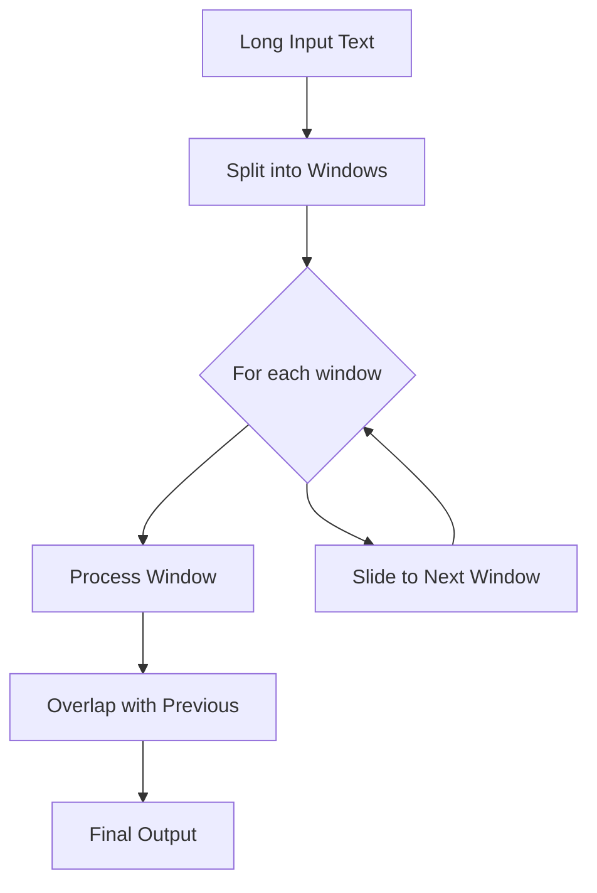
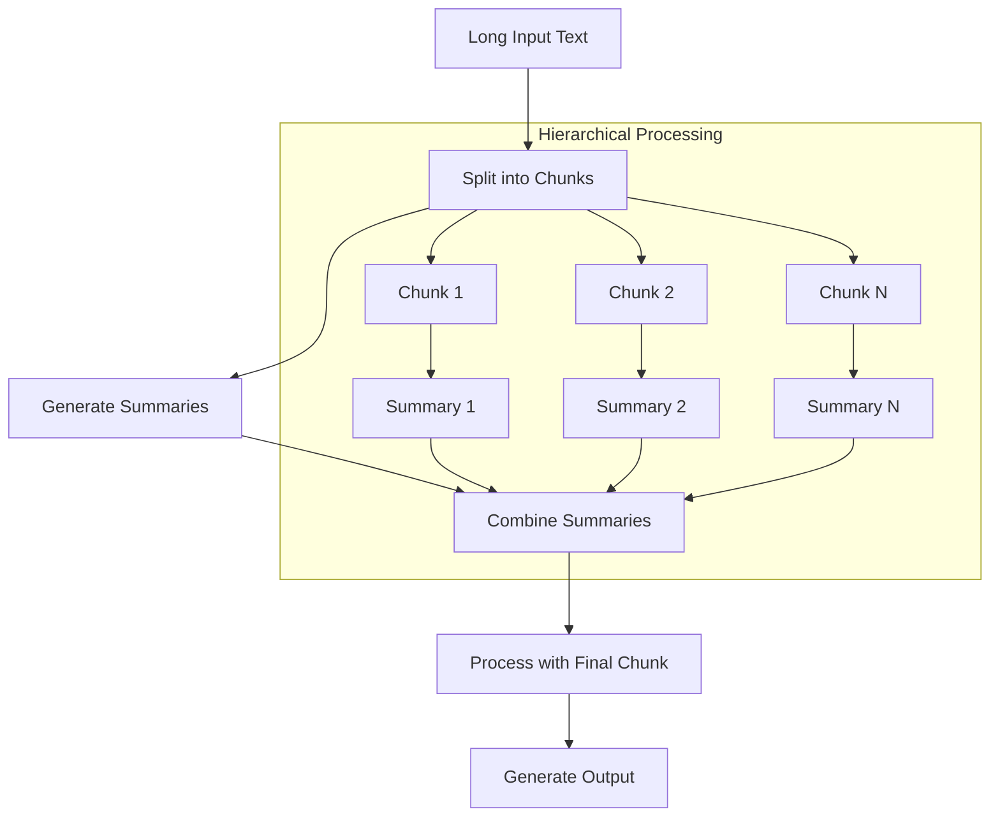
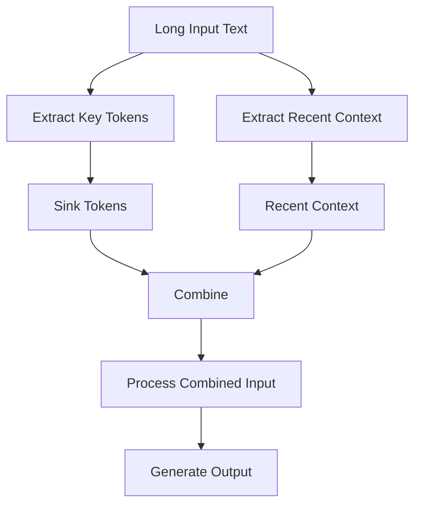
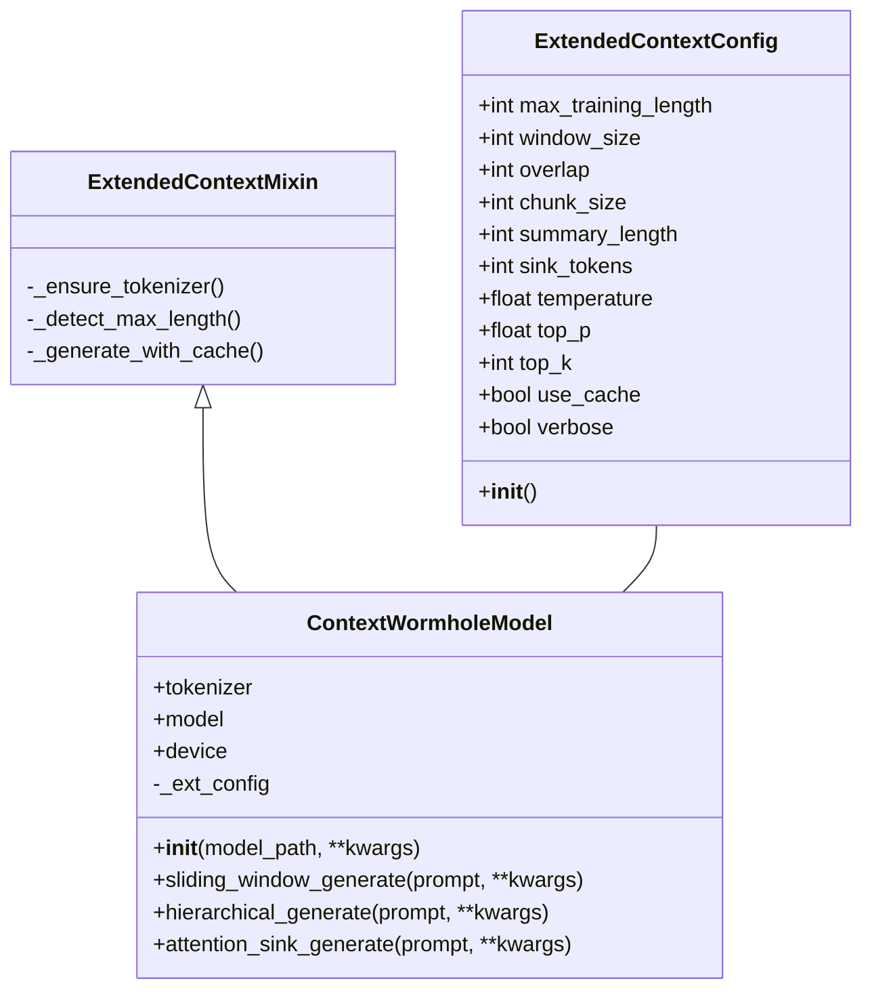
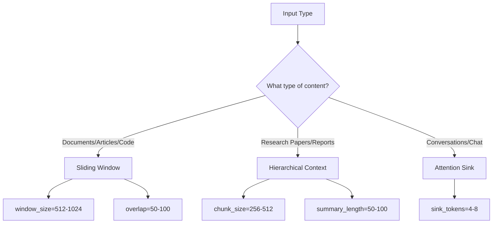
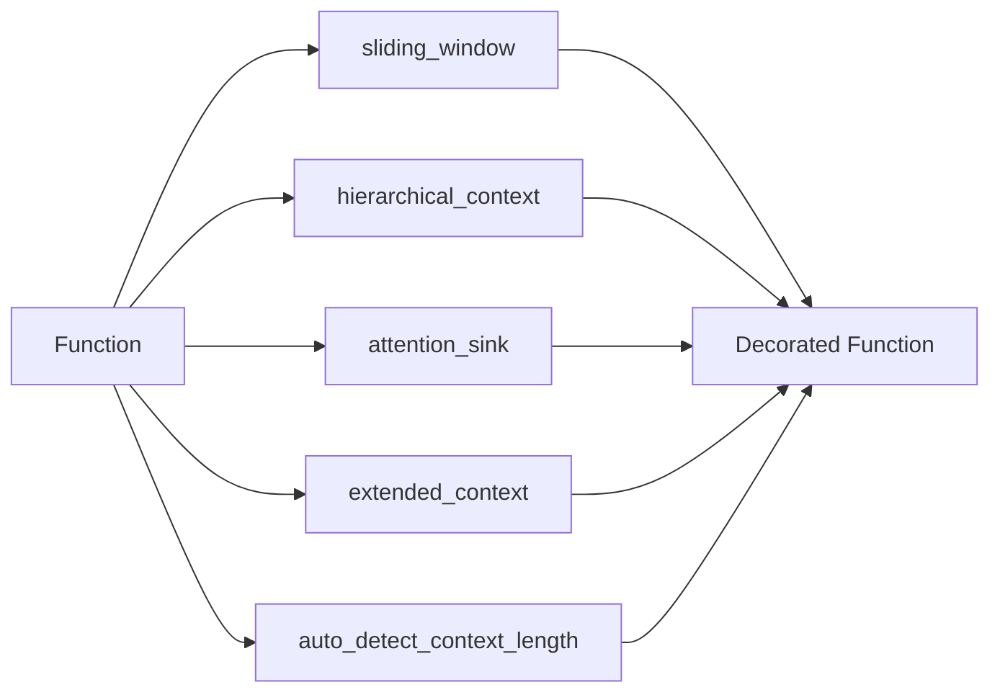

# 🌌 ContextWormhole

[](https://pypi.org/project/contextwormhole/)
[](https://pypi.org/project/contextwormhole/)
[](https://github.com/contextwormhole/contextwormhole/blob/main/LICENSE)
[](https://github.com/contextwormhole/contextwormhole/actions)

**Teleport beyond context limits with transformers**

ContextWormhole is a Python library that extends the context length capabilities of transformer models, allowing them to process inputs that exceed their maximum context window. It provides multiple strategies for handling long contexts efficiently.

## 🚀 Quick Install

```bash
pip install contextwormhole
```

## 🔧 Core Strategies

ContextWormhole implements three primary strategies for extending context length:

### 1. Sliding Window



The sliding window approach processes text in overlapping chunks, maintaining continuity between segments. This is ideal for documents, articles, and code analysis.

### 2. Hierarchical Context



Hierarchical context processing creates summaries of earlier chunks and combines them with the final chunk, enabling the model to maintain awareness of the entire document. Best for research papers and structured documents.

### 3. Attention Sink



The attention sink mechanism keeps a small number of "sink tokens" from the beginning of the input, combined with the most recent context. This approach is particularly effective for conversations and chat histories.

## 💻 Usage Examples

### Basic Usage

```python
from contextwormhole import ContextWormholeModel

# Initialize with any Hugging Face model
model = ContextWormholeModel("gpt2")

# Process long text with different strategies
result1 = model.sliding_window_generate(long_document)
result2 = model.hierarchical_generate(research_paper)
result3 = model.attention_sink_generate(conversation_history)
```

### Custom Decorators

```python
from contextwormhole import sliding_window, hierarchical_context, attention_sink

# Apply to your own functions
@sliding_window(window_size=512, overlap=50)
def process_document(model, text, **kwargs):
    return model.generate(text, **kwargs)

@hierarchical_context(chunk_size=256, summary_length=50)
def analyze_paper(model, paper, **kwargs):
    return model.generate(f"Analyze: {paper}", **kwargs)

@attention_sink(sink_tokens=4)
def continue_conversation(model, chat_history, **kwargs):
    return model.generate(chat_history, **kwargs)
```

### Advanced Configuration

```python
from contextwormhole import ContextWormholeModel, ExtendedContextConfig

# Create custom configuration
config = ExtendedContextConfig(
    max_training_length=2048,  # Original model's context length
    window_size=1024,          # Size of sliding window
    overlap=100,               # Overlap between windows
    chunk_size=512,            # Size of chunks for hierarchical processing
    summary_length=64,         # Length of summaries in hierarchical processing
    sink_tokens=8,             # Number of sink tokens for attention sink
    temperature=0.9,           # Generation temperature
    top_p=0.95,                # Top-p sampling parameter
    top_k=50,                  # Top-k sampling parameter
    use_cache=True,            # Use KV cache during generation
    verbose=True               # Print verbose output
)

# Initialize with custom config
model = ContextWormholeModel("gpt2-large", **config.__dict__)
```

## 🔍 Internal Architecture



## ⚡ Performance Optimization

### Strategy Selection



### Memory Management Tips

- **Window Size**: Adjust based on available GPU memory
- **Overlap Size**: Larger overlap = better continuity but slower processing
- **Chunk Size**: Smaller chunks = more granular summaries
- **Caching**: Enable `use_cache=True` for better performance
- **Device Placement**: Consider CPU vs GPU based on model size

## 🛠️ Development Setup

```bash
# Clone the repository
git clone https://github.com/contextwormhole/contextwormhole.git
cd contextwormhole

# Install in development mode with all extras
pip install -e ".[all]"

# Run tests
pytest tests/

# Run with coverage
pytest --cov=contextwormhole tests/
```

## 🔌 API Reference

### Decorators



- `@sliding_window(window_size=None, overlap=None)`: Process with sliding window
- `@hierarchical_context(chunk_size=None, summary_length=None)`: Process with hierarchical approach
- `@attention_sink(sink_tokens=None)`: Process with attention sink mechanism
- `@extended_context(strategy="sliding_window", **kwargs)`: Meta-decorator that selects strategy
- `@auto_detect_context_length`: Auto-detects model's context length

### Factory Functions

- `create_extended_model(model_path, device=None, **kwargs)`: Creates a ContextWormholeModel

## 📊 Benchmarks

| Strategy | Context Length | Memory Usage | Processing Time | Quality |
|----------|---------------|--------------|----------------|---------|
| Sliding Window | 10K tokens | Medium | Fast | Good |
| Hierarchical | 20K tokens | High | Medium | Better |
| Attention Sink | 8K tokens | Low | Very Fast | Best for chat |

## 🔒 License

MIT License

## 🤝 Contributing

Contributions are welcome! Check out the [issues](https://github.com/contextwormhole/contextwormhole/issues) page for ideas.

1. Fork the repository
2. Create your feature branch (`git checkout -b feature/amazing-feature`)
3. Commit your changes (`git commit -m 'Add some amazing feature'`)
4. Push to the branch (`git push origin feature/amazing-feature`)
5. Open a Pull Request

## 📚 Citation

```bibtex
@software{contextwormhole2025,
  author = {ContextWormhole Team},
  title = {ContextWormhole: Teleport beyond context limits with transformers},
  url = {https://github.com/contextwormhole/contextwormhole},
  version = {1.0.0},
  year = {2025},
}